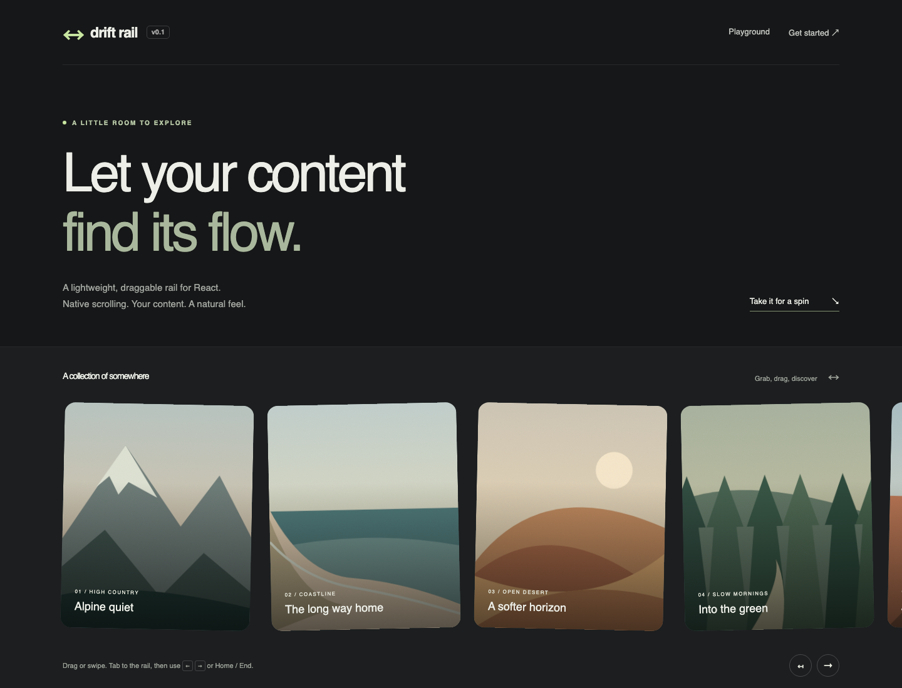

# Drift Rail

A small React component for a horizontally draggable strip of images, cards, or arbitrary content. It uses native scrolling, preserves touch momentum, and adds mouse/pen dragging and keyboard navigation. No slides, autoplay, or active-item state.

**Status:** pre-release. `react-drift-rail` is the proposed npm name; this repository is intentionally marked private until release metadata is configured. The package has **zero runtime dependencies** beyond React peers. No Tailwind or CSS framework required.

## Quick start

After the first npm release:

```sh
npm install react-drift-rail
```

```tsx
import { DraggableRail } from 'react-drift-rail';
import 'react-drift-rail/styles.css';

export function Gallery() {
  return (
    <DraggableRail aria-label="Travel photos" gap={24}>
      
      
    </DraggableRail>
  );
}
```

Before publication, run `npm ci && npm run dev` in this repository to try the playground. To install into another application, run `npm pack` here, then `npm install /absolute/path/to/react-drift-rail-0.1.0.tgz` in that application. The package requires its stylesheet; content remains ordinary HTML during SSR.



## API

`DraggableRail` renders a single `div`. Children remain direct children. All normal div attributes and events pass through, except the two drag callbacks described below.

| Prop                                | Type                              | Default   | Purpose                                                     |
| ----------------------------------- | --------------------------------- | --------- | ----------------------------------------------------------- |
| `children`                          | `ReactNode`                       | —         | Any React content                                           |
| `hideScrollbar`                     | `boolean`                         | `false`   | Hide native scrollbars, preserving scrolling and focus      |
| `initialPosition`                   | `'start' \| 'center' \| 'end'`    | `'start'` | Initial reading-order viewport, read once on mount          |
| `gap`                               | CSS `gap` value                   | `16`      | Numbers are pixels; strings accept CSS lengths              |
| `dragEnabled`                       | `boolean`                         | `true`    | Enables custom mouse/pen dragging                           |
| `momentum`                          | `boolean`                         | `false`   | Adds mouse/pen inertia after release                        |
| `onDragStart`                       | `(info: RailDragInfo) => void`    | —         | Runs once when movement passes the threshold                |
| `onDragEnd`                         | `(info: RailDragEndInfo) => void` | —         | Runs on release or input cancellation                       |
| `ref`                               | `Ref<HTMLDivElement>`             | —         | The native scrolling element                                |
| `dir`                               | HTML `dir`                        | inherited | Use `rtl` for right-to-left layouts                         |
| `aria-label` / `aria-labelledby`    | `string`                          | —         | Gives the rail an accessible name and default `region` role |
| `tabIndex`                          | `number`                          | `0`       | Makes the rail keyboard-focusable                           |
| `className`, `style`, `onScroll`, … | Normal div props                  | —         | Consumer styling and standard events                        |

`RailDragInfo` contains `pointerType: 'mouse' | 'pen'` and `scrollLeft: number`. `RailDragEndInfo` also contains `cancelled: boolean`. These are **rail gesture callbacks**, not HTML drag-and-drop events. Native touch scrolling does not invoke them. Cleanup on unmount or a `dragEnabled`/`momentum` configuration change stops the gesture without emitting callbacks. Use `onScroll` to observe all scrolling, including touch and programmatic changes.

Exported types: `DraggableRailProps`, `RailDragInfo`, `RailDragEndInfo`. No private engine types are public exports. React 18.2 and React 19 are supported.

## Start in the middle

```tsx
<DraggableRail initialPosition="center" aria-label="Travel photos">
  {photos.map((photo) => (
    
  ))}
</DraggableRail>
```

`center` starts halfway through the available scroll range, leaving room to drag in both directions when the content overflows. `end` starts at the reading-order end. Both work with `dir="rtl"`. This centers the entire content, not a specific item.

The position is set when the DOM ref attaches, before the first client paint. It follows item/container size changes and newly added direct children until the first pointer, wheel, keyboard, focus-driven scroll, or programmatic scroll. After that, resizing or new content will not pull the reader back. `initialPosition` is an initial value: changing it on an existing instance does not reset scrolling. Use the native ref to move later, or change the component's `key` to start fresh.

SSR HTML itself has no scroll offset; the initial position is applied during hydration. Give images explicit dimensions to reserve space before they load. Resize tracking uses `ResizeObserver`; where unavailable, initial placement and child-list updates still work.

## Programmatic scrolling

The ref exposes the browser's own API instead of a second wrapper API:

```tsx
import { useRef } from 'react';
import { DraggableRail } from 'react-drift-rail';
import 'react-drift-rail/styles.css';

export function WithControls() {
  const rail = useRef<HTMLDivElement>(null);
  return (
    <>
      <button onClick={() => rail.current?.scrollBy({ left: 300, behavior: 'instant' })}>
        Move right
      </button>
      <DraggableRail ref={rail} aria-label="Cards">
        <article style={{ width: 340 }}>First card</article>
        <article style={{ width: 340 }}>Second card</article>
      </DraggableRail>
    </>
  );
}
```

Start is `scrollTo({ left: 0 })`. In LTR, end is `scrollWidth - clientWidth`; in RTL, negate that value. Native coordinates are physical: positive `scrollBy` moves right. If you request smooth scrolling yourself, check `prefers-reduced-motion` first. Avoid starting a programmatic animation while a pointer gesture or optional momentum is running.

## Styling and custom children

The stylesheet owns only horizontal flex layout, overflow, focus outline, scrollbar styling, and active-drag feedback. It adds `flex-shrink: 0` to direct children; consumers set item dimensions, colors, rounding, and typography. Use one element around each multi-element card. Plain text also renders, but should be wrapped when you need per-item spacing.

```tsx
<DraggableRail className="products" gap="clamp(12px, 3vw, 32px)" aria-label="Products">
  {products.map((product) => (
    <article key={product.id} className="product-card">
      <a href={product.url}>{product.name}</a>
      <button onClick={() => addToCart(product.id)}>Add to cart</button>
    </article>
  ))}
</DraggableRail>
```

```css
.products {
  padding: 16px 4px;
  --drift-rail-scrollbar: #66776688;
}
.product-card {
  width: min(320px, 80vw);
  border-radius: 16px;
}
```

Scrollbars remain visible according to OS preferences by default. Set `hideScrollbar` to show only your content, while keeping dragging, touch, trackpad, keyboard, and programmatic scrolling. Provide an accessible label and a clear scrolling affordance when hiding the scrollbar. Do not override `display: flex`, horizontal overflow, or set `scroll-behavior: smooth` on the rail: pointer movement requires immediate scrolling. CSS `style.gap` overrides the `gap` prop.

```tsx
<DraggableRail initialPosition="center" hideScrollbar aria-label="Travel photos">
  {photos.map((photo) => (
    
  ))}
</DraggableRail>
```

Native inputs, selects, textareas, editable content, audio/video controls, and explicitly draggable elements are excluded from custom dragging. Add `data-rail-no-drag` to any other child area to preserve text selection, custom gestures, or native drag-and-drop there. Links and buttons remain draggable surfaces; a drag suppresses its ensuing pointer click. Tiny movement stays a click, and keyboard activation is preserved. Active dragging prevents selection only inside the rail.

## Next.js and SSR

Both published JavaScript formats preserve a top-level `'use client'` directive. No module reads `window` or `document` at evaluation time. An App Router Server Component can render the rail and pass serializable props and rendered children:

```tsx
// app/page.tsx — a Server Component
import Image from 'next/image';
import { DraggableRail } from 'react-drift-rail';

export default function Page() {
  return (
    <DraggableRail aria-label="Portfolio" gap={24}>
      <Image src="/work.jpg" alt="A courtyard in afternoon light" width={320} height={400} />
      <Image src="/studio.jpg" alt="A sunlit studio" width={400} height={400} />
    </DraggableRail>
  );
}
```

Import `react-drift-rail/styles.css` once in `app/layout.tsx` (or `pages/_app.tsx` for the Pages Router). If using refs or callback props, place that composition in your own Client Component with `'use client'`. Drift Rail has no Next.js runtime dependency and does not wrap, fetch, or optimize your images. Set image dimensions to avoid layout shift.

See the runnable [Next.js example](examples/next) and [React playground](examples/react). Both share the repository's development dependencies; this is a single-package repository, not a workspace monorepo.

## Accessibility and input behavior

- Focus the rail with Tab. Left/Right move physically by 80% of the visible width; Home/End move to reading-order start/end, including RTL. Scrolling is immediate.
- Keys from child links, buttons, and inputs are left alone. Modified keys are left alone. A consumer `onKeyDown` can call `preventDefault()` to override the rail's handling.
- A named rail defaults to `role="region"`; an unnamed one gets no invented role. Supply a meaningful label for every navigable rail, or explicitly choose another appropriate role. Avoid adding many redundant landmarks.
- Visible focus styling is included. Children retain normal focus order, and native browser scrolling reveals focused offscreen controls.
- Touch panning, pinch zoom, and touch momentum are browser-managed with `touch-action: auto`. Pen events use custom dragging when the browser dispatches them; devices that claim the gesture for native panning may issue `pointercancel` and continue natively.
- Optional mouse/pen momentum stops for a new gesture, wheel/keyboard input, focus entry, window blur, cancellation, or cleanup. Reduced-motion preferences disable it, including changes during animation.
- A six-pixel horizontal threshold distinguishes clicks from dragging. Vertical gestures yield. Only an active custom drag calls `preventDefault()` on pointer movement.
- A child or consumer can veto a pointer start in `onPointerDownCapture` using `preventDefault()`. The controller uses native listeners, so React bubble handlers run after its pointerdown listener.

Automated checks cover interaction and common WCAG rules; they do not replace manual screen-reader and real-device testing. See [validation](docs/VALIDATION.md) for actual coverage and limits.

## Browser support

Target: current evergreen Chrome/Chromium, Firefox, Safari, mobile Safari, and Chromium Android. Required APIs include Pointer Events, pointer capture, `requestAnimationFrame`, and `MediaQueryList.addEventListener`; no legacy polyfills are shipped. The test matrix uses Playwright Chromium, Firefox, and WebKit plus mobile viewport/touch emulation. On macOS 14, current Playwright cannot create a page in its frozen WebKit build; see the validated workaround and exact test results in [validation](docs/VALIDATION.md).

RTL uses the modern negative `scrollLeft` model and clamps overscroll. Legacy positive/reversed RTL models are unsupported. See [MDN's scrollLeft documentation](https://developer.mozilla.org/en-US/docs/Web/API/Element/scrollLeft). Native touch behavior follows [touch-action](https://developer.mozilla.org/en-US/docs/Web/CSS/Reference/Properties/touch-action). WebKit automation is useful coverage, but is not a claim of testing physical iPhones or the shipping Safari application.

## Development

For repository development, use current Node 24 LTS (24.15+) or Node 26 and npm. The test toolchain requires these newer versions; the published package itself declares Node 22.14+ for Node-based consumers. Commit `package-lock.json` with dependency changes.

```sh
npm ci
npm run dev                  # React playground
npm run build                # ESM, CJS, declarations, CSS, source maps
npm run dev:next             # Build first; Next.js example on port 3001
npm run check                # Build, formatting, lint, types, unit tests, package checks
npx playwright install      # One-time browser downloads
npm run test:e2e             # Chromium, Firefox, WebKit, mobile projects
npm run test:package         # Install tarball with React 18 and 19; verify exports and SSR
npm run build:demo
npm run build:next
npm run test:next             # Production App Router hydration and dragging
npm run format
```

`npm run dev` consumes source for fast feedback. Next.js and the tarball smoke tests consume built exports. Rebuild after library edits before using the Next.js example. `npm run size` budgets each JS entry to 6 KiB gzip and CSS to 1 KiB gzip, verifies package contents, and checks that React is external. Actual sizes and test results are recorded in [validation](docs/VALIDATION.md).

## Contributing and releases

Read [CONTRIBUTING.md](CONTRIBUTING.md), [CODE_OF_CONDUCT.md](CODE_OF_CONDUCT.md), and [SECURITY.md](SECURITY.md). Small focused changes with reproducible interaction tests are welcome. [Architecture notes](docs/ARCHITECTURE.md) explain the design choices.

Versioning follows SemVer. Before 1.0, breaking API changes increment the minor version and are documented in the changelog. Follow [the publishing checklist](docs/PUBLISHING.md) before the first release. No npm package or GitHub repository is created by this local project.

## Roadmap

- Manual assistive-technology and physical iOS/Android/pen validation before 1.0.
- Improve velocity sampling from real-device feedback.
- Consider an extracted core only if another framework implementation has an actual maintainer.

Autoplay, active slides, infinite looping, virtualization, and lightboxes are outside v1's scope.

MIT licensed. The local landscape SVG artwork is original demo material released under the same license.
